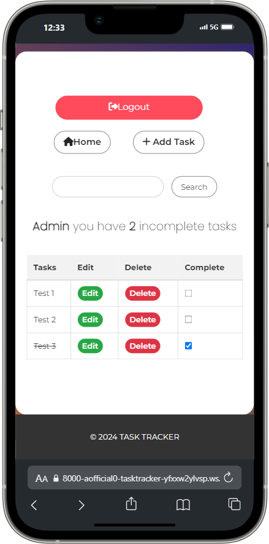

# Welcome to TaskTracker

## A Task Organiser Website.

## Am I Responsive?

### [Link to the live site](https://tasktrackerr-8c1432966470.herokuapp.com)

#### - By Ahmed Mohamed

---

## Table of contents

1.  [ UX ](#ux)
2.  [ Agile Development ](#agile-development)
3.  [ Features implemented ](#features-implemented)
4.  [ Features Left to Implement ](#features-left-to-implement)
5.  [ Technology used ](#technology-used)
6.  [ Testing ](#testing)
7.  [ Deployment](#deployment)
8.  [ Credits and References ](#Credits-and-References)

---

## UX design

### Overview

#### Design

> Initial design planning

Early design stage of this project was created in Balsamic.

I wanted the website to be easy to use by creating a simple design.

#### Target Audience

- Individuals and professionals looking to manage their daily tasks effectively.
- Students who need to keep track of assignments and deadlines.
- Anyone who wants to improve productivity by organizing their tasks and to-dos.

#### Goals for the website

- Task Management: Provide users with an intuitive interface to create, update, and delete tasks.
- Task Completion Tracking: Allow users to mark tasks as complete, which visually indicates progress with a strikethrough.
- Search Functionality: Enable users to quickly search for tasks by entering keywords.
- User Authentication: Secure the app with user login and registration features to keep tasks private and personal.
- Notifications: Provide feedback to users through alerts when tasks are successfully updated, created, or deleted.
- Responsiveness: Ensure the application is accessible and easy to use on all devices, including desktops, tablets, and mobile phones.

##### [ Back to Top ](#table-of-contents)

---

# Agile Development

## Overview

I used GitHub projects to develop my site.

## User Stories

My user stories encompassed all the essential features that I believed would deliver the most value to the user. I prioritized a focused, streamlined approach by adhering to agile principles and concentrating on developing a Minimum Viable Product (MVP). This strategy allows for a strong foundation that can be iteratively enhanced and expanded over time, ensuring that future updates continue to meet user needs while maintaining a manageable scope.

> List of some of the User Stories

1. https://github.com/Aofficial0/TaskTracker/issues/1
2. https://github.com/Aofficial0/TaskTracker/issues/11
3. https://github.com/Aofficial0/TaskTracker/issues/3
4. https://github.com/Aofficial0/TaskTracker/issues/5
5. https://github.com/Aofficial0/TaskTracker/issues/4
6. https://github.com/Aofficial0/TaskTracker/issues/2
7. https://github.com/Aofficial0/TaskTracker/issues/12

##### [ Back to Top ](#table-of-contents)

---

# Features implemented

- Task Management: Users can create, view, update, and delete tasks, providing a complete CRUD (Create, Read, Update, Delete) experience for managing their to-dos.
- Task Completion Tracking: Allows users to mark tasks as complete with a visual indicator, enhancing task management and organization.
- Search Functionality: Users can quickly find tasks by entering search queries, improving efficiency and usability.
- User Authentication: Users can sign up, log in, and manage their accounts securely. Authentication is handled through Django’s built-in features, including CSRF protection for added security.
- Incomplete Notification: The interface displays a notification with the number of incomplete tasks, helping users quickly assess task statuses. This feature ensures that important task metrics are easily accessible.
- Responsive Design: The app is designed to be fully responsive, ensuring a seamless experience across various devices and screen sizes, with media queries and flexible layouts.

### Task List page:

- Task Overview: The Task List presents a comprehensive view of all tasks, including their status, and allows users to interact with tasks efficiently.

### Task Form page:

- Task Creation and Editing: Users can create new tasks or edit existing ones via a user-friendly form, which includes fields for task details and description.

### Authentication and Profile Management:

- Sign-Up and Login: Users can register and log in to their accounts, offering personalized access to their tasks.
- Task Completion: Users can mark tasks as complete with a visual indicator. This feature helps in tracking progress and managing tasks effectively.

### User Experience Enhancements:

- Search Bar: Quickly locate tasks by typing into the search bar.
- Alerts and Notifications: Users receive alerts for successful task updates or other relevant actions, improving feedback and interaction.

##### [ Back to Top ](#table-of-contents)

---

# Features Left to Implement

- Due Date and Reminders.
- Task Prioritization.
- Task Categories and Tags.
- Task Collaboration and Sharing.

##### [ Back to Top ](#table-of-contents)

---

# Technology used

- HTML: Provides the structure and layout of web pages, ensuring semantic and well-organized content.
- CSS: Utilized for custom styling, creating visually appealing and responsive designs.
- Python: Serves as the primary programming language for backend development.
- JavaScript: Implements dynamic behavior, such as marking tasks complete from task list page, enhancing interactivity and user experience.
- Django - framework used to build this project
- Bootstrap 5: Employs this popular CSS framework to ensure a responsive and mobile-first design, improving the app's overall usability across devices.
- PostgreSQL: Chosen as the relational database service for its reliability and ease of integration with Heroku.
- Font Awesome - for icons
- Google Fonts
- GitHub: Used for version control and code repository management, along with Kanban boards for project management.
- Heroku: Provides the cloud platform for hosting and deployment, ensuring the app is accessible and scalable.
- Git: For version control.

##### [ Back to Top ](#table-of-contents)

---

# Testing

### Responsiveness

tested for responsiveness in Google Chrome, using devtools

> PC:

> Phone:

> Tablet:

#### Account Registration Tests

| Test                               | Result |
| ---------------------------------- | ------ |
| User can create profile            | Pass   |
| User can log into profile          | Pass   |
| User can log out of profile        | Pass   |
| Messages and alerts are displaying | Pass   |

---

#### User Navigation Tests

| Test                                      | Result |
| ----------------------------------------- | ------ |
| User can easily navigate through the site | Pass   |
| SuperUser can access admin page           | Pass   |

---

#### CRUD Tests

| Test                   | Result |
| ---------------------- | ------ |
| User can create a task | Pass   |
| User can edit a task   | Pass   |
| User can delete a task | Pass   |
| User can read a task   | Pass   |

#### Jigsaw and HTML Validation and CI Python Linter

- I used the W3 HTML Validator to check the HTML on each of my site pages by Direct Input. I have resolved the necessary errors.
- I used the W3 CSS Validator to check my CSS script by Direct Input. I found no errors!

- I used the CI Python Linter to check all my python scripts. I found a few small errors like the below - mostly lines were too long or there was a missing blank space line. I have left some of the error messages as they are related to a too long line at the result of a comment.

#### Performance

- PC Performance

- Mobile Performance

#### Deployment

- Repository created in Git

  A Git repository was created to track the project's code and changes, ensuring efficient version control and a history of all modifications.

- Deployed to Heroku

  The application was deployed to Heroku, a cloud platform, allowing it to be accessible online with managed infrastructure.

- Connected Secret Keys to config vars

  Sensitive information, such as secret keys, was securely managed (config vars), ensuring they remain separate from the codebase.

- Connected Code Institute PostGres Database

  The application is connected to a PostgreSQL database provided by Code Institute to manage and store data securely.

---

#### Credits and References

- [Django Documentation](https://www.djangoproject.com/)
- [Mdn](https://developer.mozilla.org/)
- Code Institute - I think before I blog
- [Bootstrap Documentation ](https://getbootstrap.com/docs/4.1/getting-started/introduction/)
- [css-gradien](https://www.css-gradient.com/)
- [Fontawesome](https://fontawesome.com/)
- [Google Fonts](https://fonts.google.com/)
- [Chat-GPT](https://openai.com/chatgpt/)
- [Stack overflow](https://stackoverflow.com/)
- Code Institute Slack channel
